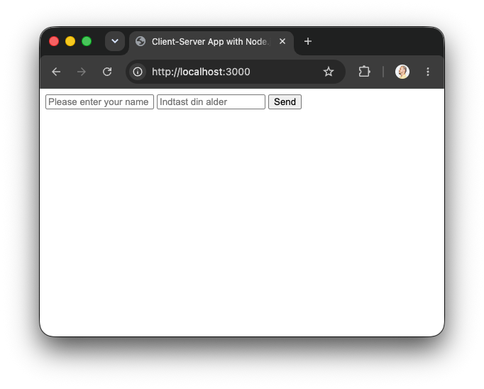
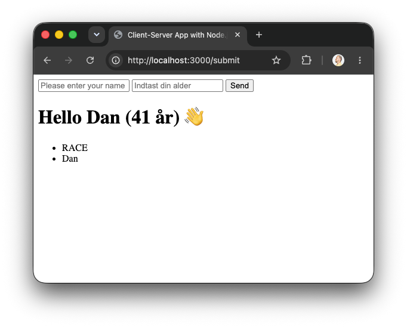

# Øvelse 2: Formhåndtering, validering og svarlogik

I [øvelse 1](express-ejs-formular.md) byggede du en EJS-app, der modtager et navn og renderer en hilsen. Nu bygger du videre i **det samme projekt**. Du udvider formularen med alder, viser fejlbeskeder og gemmer gyldige navne i et array.

Skriv koden selv, og test efter hvert trin. Målet er ikke at kende den færdige løsning på forhånd, men at kunne følge data hele vejen fra formularen til serveren og tilbage til EJS.

Når øvelsen er færdig, har du både en formular og et svar på samme side:





## Det bygger du

```text
Browser -> POST /submit -> request.body -> validering -> response.render() -> EJS -> HTML
```

Du bruger disse fire værdier i templaten:

- `name`: navnet fra formularen
- `age`: alderen fra formularen
- `error`: en fejlbesked eller en tom tekst
- `names`: arrayet med de gyldige navne

> **Validering** betyder, at serveren kontrollerer data, før den bruger dem. Browserens `required`-attribut er nyttig, men serveren skal stadig selv kontrollere dataene.

---

## 1. Start fra øvelse 1

Åbn projektet fra øvelse 1, og start serveren:

```bash
npm run dev
```

Kontrollér, at du stadig har:

- `app.use(express.urlencoded({ extended: true }))`
- en GET-route til `/`
- en POST-route til `/submit`
- `views/index.ejs`

### Test trin 1

Indsend et navn. Kig i terminalen, hvis du stadig har `console.log(request.body)` fra øvelse 1. Du bør se et objekt med feltet `name`.

---

## 2. Vis en fejl, hvis navnet mangler

Vi begynder kun med navnet. I `server.js` skal GET-routen altid sende en tom fejlbesked og et tomt navn til EJS:

```js
app.get("/", (request, response) => {
  response.render("index", { name: "", error: "" });
});
```

Opdatér derefter POST-routen. Først læser du navnet, derefter vælger du en fejlbesked, og til sidst renderer du den samme side igen:

```js
app.post("/submit", (request, response) => {
  const name = request.body.name;
  let error = "";

  if (!name || name.trim() === "") {
    error = "Skriv dit navn, før du sender formularen.";
  }

  response.render("index", { name, error });
});
```

I `views/index.ejs` skal du vise fejlen, men kun når der er en:

```ejs
<% if (error) { %>
  <p><%= error %></p>
<% } %>
```

Sæt koden lige under formularen eller lige over den — vælg det sted, hvor en bruger naturligt vil opdage fejlen.

> `let error = ""` opretter en tom fejlbesked. Hvis navnet mangler, ændrer `if`-sætningen teksten. `<% if (...) { %>` i EJS bestemmer, om HTML-stykket skal være med i den færdige side.

### Test trin 2

Send formularen med et tomt navnefelt. Fejlbeskeden skal vises. Send derefter et rigtigt navn. Fejlbeskeden skal forsvinde.

---

## 3. Gem gyldige navne i et array

Nu skal et gyldigt navn blive liggende på serveren, mens appen kører. Opret arrayet **over** dine routes:

```js
const names = [];
```

Tilføj `names` til dataene i GET-routen:

```js
response.render("index", { name: "", error: "", names });
```

I POST-routen tilføjer du kun navnet, når der ikke er fejl. Sæt derfor dette ind som `else` efter din `if`-sætning:

```js
else {
  names.push(name);
}
```

POST-routen skal nu også sende `names` til EJS:

```js
response.render("index", { name, error, names });
```

> **Array og `push()`:** `names` er en liste. `names.push(name)` lægger det aktuelle navn ind sidst i listen. Fordi arrayet er oprettet uden for routes, findes det stadig ved næste request, så længe serveren kører.

### Test trin 3

Indsend to forskellige navne. Læg midlertidigt denne linje ind i POST-routen efter `names.push(name)`:

```js
console.log(names);
```

Terminalen bør først vise ét navn og derefter begge navne. Fjern gerne loggen igen, når du har set det.

---

## 4. Render listen i EJS

Serveren har nu dataene, men browseren viser dem ikke endnu. Tilføj dette i `views/index.ejs` under formularen:

```ejs
<h2>Indsendte navne</h2>

<ul>
  <% for (const name of names) { %>
    <li><%= name %></li>
  <% } %>
</ul>
```

> **Loop i EJS:** Koden mellem `<%` og `%>` kører på serveren, mens EJS bygger HTML. For hvert navn i arrayet bliver der lavet ét `<li>`-element. `<%= name %>` indsætter og HTML-escaper værdien sikkert.

### Test trin 4

Indsend et nyt navn. Det skal både ses i terminalen og som et punkt på siden. Genindlæs derefter siden: Listen skal stadig vises, mens serveren fortsat kører.

---

## 5. Tilføj et felt til alder

Udvid formularen i `views/index.ejs` med et aldersfelt. `name="age"` er vigtigt: Det bliver nøglen på `request.body`.

```html
<label for="age">Hvor gammel er du?</label>
<input id="age" name="age" type="number" step="any" />
```

Placer feltet inde i den eksisterende `<form>` og før submit-knappen. Indsend derefter formularen med både navn og alder.

Sæt eller behold denne log i starten af POST-routen:

```js
console.log(request.body);
```

### Test trin 5

Indsend for eksempel `Ada` og `41`. Terminalen skal nu vise noget i stil med:

```js
{ name: "Ada", age: "41" }
```

Selv om input-feltet har `type="number"`, modtager Express værdien som tekst. Derfor skal serveren kontrollere den.

---

## 6. Kontrollér først, at alder er et tal

Læs alder fra `request.body` lige efter navnet:

```js
const age = request.body.age;
```

Nu skal alle renders sende de samme fire værdier. Ret GET-routen til:

```js
app.get("/", (request, response) => {
  response.render("index", { name: "", age: "", error: "", names });
});
```

Erstat derefter `if`-delen i POST-routen med denne rækkefølge:

```js
if (!name || name.trim() === "") {
  error = "Skriv dit navn, før du sender formularen.";
} else if (!age || Number.isNaN(Number(age))) {
  error = "Skriv en alder som et tal.";
} else {
  names.push(name);
}
```

Til sidst skal POST-routen rendere med `age` også:

```js
response.render("index", { name, age, error, names });
```

> `Number(age)` forsøger at lave teksten om til et tal. `Number.isNaN(...)` undersøger, om resultatet *ikke* er et tal. Vi gemmer ikke et ekstra tal i en ny variabel endnu — fokus er først på at få kontrollen til at virke.

> Browseren vil normalt forhindre bogstaver i et felt med `type="number"`. Hvis du vil afprøve serverens kontrol med værdien `hej`, kan du midlertidigt ændre feltet til `type="text"`, teste og derefter ændre det tilbage. Pointen er, at serveren stadig skal validere data og ikke kun stole på browseren.

### Test trin 6

Prøv disse inputs:

| Navn | Alder | Forventet resultat |
| --- | --- | --- |
| tomt felt | `25` | Fejl om navn |
| `Ada` | tomt felt | Fejl om alder |
| `Ada` | `hej` | Fejl om alder |
| `Ada` | `41` | Navnet tilføjes til listen |

Lige nu er `12.5`, `0` og `121` stadig tal og bliver accepteret. Det gør vi mere præcist i næste trin.

---

## 7. Gør aldersreglen mere præcis

Vi vil kun acceptere hele aldre fra 1 til 120. Indsæt endnu en `else if` **efter** kontrollen for, om alder er et tal, og **før** `else` med `names.push(name)`:

```js
else if (!Number.isInteger(Number(age)) || Number(age) < 1 || Number(age) > 120) {
  error = "Skriv en alder som et helt tal mellem 1 og 120.";
}
```

> Den første alderskontrol svarer på: “Er det overhovedet et tal?” Denne nye kontrol svarer på: “Er det et helt tal inden for vores regler?” Rækkefølgen er vigtig, fordi vi først vil afvise manglende eller ugyldige tal.

### Test trin 7

Prøv `12.5`, `0`, `121` og `41`. Kun `41` skal tilføje et navn til listen.

---

## 8. Byg hilsenen af værdierne i EJS

Serveren sender allerede `name`, `age` og `error`, så EJS kan sætte dem sammen til hilsenen.

Tilføj dette i `views/index.ejs`, for eksempel under fejlbeskeden:

```ejs
<% if (name && age && !error) { %>
  <h2>Hello <%= name %> (<%= age %> år) 👋</h2>
<% } %>
```

Hilsenen bliver kun vist, når formularen er sendt uden fejl. Ved en fejl renderer serveren stadig den samme template, men betingelsen gør, at hilsenen ikke kommer med i HTML'en.

### Test trin 8

Indsend `Ada` og `41`. Du skal se både hilsenen og `Ada` i listen. Indsend derefter en ugyldig alder: Du skal kun se fejlbeskeden.

---

## 9. Saml og gennemgå POST-routen

Din færdige POST-route kan nu se sådan ud. Sammenlign den med din egen, før du retter noget:

```js
app.post("/submit", (request, response) => {
  const name = request.body.name;
  const age = request.body.age;
  let error = "";

  if (!name || name.trim() === "") {
    error = "Skriv dit navn, før du sender formularen.";
  } else if (!age || Number.isNaN(Number(age))) {
    error = "Skriv en alder som et tal.";
  } else if (!Number.isInteger(Number(age)) || Number(age) < 1 || Number(age) > 120) {
    error = "Skriv en alder som et helt tal mellem 1 og 120.";
  } else {
    names.push(name);
  }

  response.render("index", { name, age, error, names });
});
```

Læg mærke til flowet:

1. Læs data fra `request.body`.
2. Start med ingen fejl.
3. Kontrollér én regel ad gangen.
4. Tilføj kun et gyldigt navn til `names`.
5. Render den samme EJS-side med alle dataene.

### Test trin 9

Åbn DevTools → **Network**, indsend formularen og vælg requestet til `/submit`. Bekræft, at det er en `POST`, og at response er en ny HTML-side. Det er server-side rendering: serveren validerer dataene og sender færdig HTML tilbage.

---

## Ekstra opgaver

De næste opgaver er små udvidelser af den færdige app. Tag dem i rækkefølge. De bruger kun de værdier, du allerede sender til EJS.

### 10. Behold det indtastede ved en fejl

Når der er en fejl, skal brugeren ikke behøve at skrive alt igen. Tilføj `value` til navnefeltet i `views/index.ejs`:

```html
<input id="name" name="name" type="text" value="<%= name %>" />
```

Gør derefter det samme for aldersfeltet:

```html
<input id="age" name="age" type="number" step="any" value="<%= age %>" />
```

> `value` bestemmer den tekst, der står i et inputfelt. EJS indsætter værdien fra `response.render(...)`. Da du allerede sender `name` og `age` med til templaten, behøver serveren ikke ny logik.

### Test trin 10

Skriv et navn og en ugyldig alder, for eksempel `Ada` og `121`. Når siden renderer igen, skal både `Ada` og `121` stadig stå i felterne sammen med fejlbeskeden.

---

### 11. Vis hvor mange navne der er gemt

Du har allerede arrayet `names`. EJS kan også vise, hvor mange elementer der er i det. Ret overskriften til listen:

```ejs
<h2>Indsendte navne (<%= names.length %>)</h2>
```

> **`.length`:** Et array har en `length`-værdi. `names.length` er antallet af navne i listen. Det er den samme liste, som dit loop i EJS allerede gennemgår.

### Test trin 11

Indsend et gyldigt navn. Tallet i overskriften skal stige med én. Genindlæs siden, og kontrollér at tallet ikke ændrer sig, så længe serveren kører.

---

### 12. Vis en besked, når listen er tom

Lige efter en genstart er `names` tomt. Gør det tydeligt for brugeren i stedet for kun at vise en tom liste.

Erstat din nuværende `<ul>` med denne EJS-betingelse og liste:

```ejs
<% if (names.length === 0) { %>
  <p>Der er endnu ikke indsendt nogen navne.</p>
<% } else { %>
  <ul>
    <% for (const name of names) { %>
      <li><%= name %></li>
    <% } %>
  </ul>
<% } %>
```

> Her bruger du den samme slags `if`-sætning som ved fejlbeskeden. Forskellen er blot, at spørgsmålet nu handler om arrayets længde.

### Test trin 12

Stop serveren med `Ctrl + C`, og start den igen med `npm run dev`. Du skal se beskeden om den tomme liste. Indsend derefter et gyldigt navn: Beskeden skal forsvinde, og listen skal vises.

---

### 13. Lav én ekstra regel selv

Vælg én af disse små udvidelser. Tilføj kun én regel ad gangen, og test den før du går videre.

- Giv en særlig fejlbesked, hvis navnet har færre end to tegn.
- Begræns listen til højst tre navne. Når listen er fuld, skal brugeren se en fejlbesked i stedet for at få sit navn tilføjet.
- Skift hilsenen, så den bruger dit eget sprog og din egen tekst.

Start med at beslutte, om reglen hører hjemme i serverens validering eller i EJS-visningen. Regler, som bestemmer om input må gemmes, hører i POST-routen. Tekst og HTML, der kun bestemmer hvordan resultatet ser ud, hører i `index.ejs`.

### Test trin 13

Vis din udvidelse til en makker. Forklar hvilken `if`-sætning der styrer den, og prøv både et input, der skal godkendes, og et input, der skal afvises.

---

## Tjekpunkt

Du er færdig, når din app kan:

- vise en fejl, hvis navnet mangler
- vise en fejl, hvis alder mangler eller ikke er et tal
- afvise decimaler og aldre uden for intervallet 1–120
- tilføje et gyldigt navn til et array
- rendere både hilsen, fejlbesked og listen med EJS

> Arrayet findes kun i serverens hukommelse. Det bliver tomt, når du stopper eller genstarter serveren. Senere kan data gemmes i en database.

## Videre til øvelse 3

I [øvelse 3: Server-renderet AMAbot med regelbaseret svarlogik](express-ejs-amabot.md) bruger du det samme POST-, validerings- og render-flow til at lade serveren vælge et svar om dig ud fra brugerens spørgsmål.
