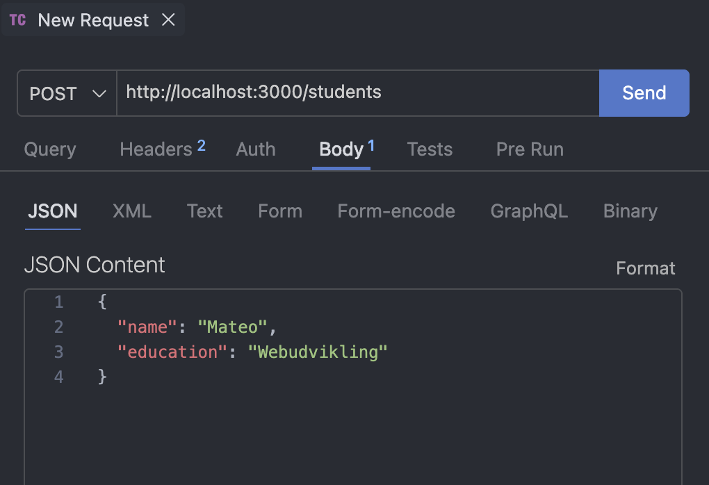

# REST API-øvelse: Studerende med CRUD

## Kort fortalt

I denne øvelse bygger du et nyt, selvstændigt Express-projekt — adskilt fra din AMAbot, ligesom [JSON-øvelsen med studerende](express-ejs-json-students.md) fra sidst. Denne gang er der ingen EJS og ingen HTML-formularer: serveren sender og modtager kun JSON, og du tester med Thunder Client i stedet for browseren.

Øvelsen er delt i to:

- **Del 1** bygger et REST API for `/students` med fuld CRUD (Create, Read, Update, Delete) — data ligger i et almindeligt array i memory.
- **Del 2** flytter de samme data over i en JSON-fil, med `loadStudents()`/`saveStudents()`, ligesom du kender fra RACE 4.

Pointen med at holde dem adskilt: CRUD-logikken (routes, route parameters, opdatering af data) og **hvor** data gemmes, er to forskellige ting. Del 2 ændrer ikke på, hvordan dine routes modtager requests eller sender svar — kun på, hvor `students` kommer fra og gemmes hen.

> **Nyt begreb — REST API:** Et REST API er en server, der stiller data til rådighed som **ressourcer** på faste URL'er (fx `/students`), i stedet for at sende færdige HTML-sider. Hver HTTP-metode har en fast betydning: GET henter, POST opretter, PUT opdaterer, og DELETE sletter.
>
> En hel samling ligger på URL'en i flertal: `/students`. Én bestemt ressource i samlingen ligger på samme URL plus dens id: `/students/:id`. Det er derfor `GET /students` og `POST /students` arbejder på hele samlingen, uden id i URL'en, mens `GET`, `PUT` og `DELETE` på én bestemt studerende alle har `:id` med.

> Statuskoder og håndtering af ugyldige id'er (fx `404`) venter til en senere øvelse — her er fokus på selve CRUD-mønsteret.

<details>
<summary>💡 Sidder du fast undervejs? Sådan bruger du hjælpen i denne øvelse</summary>

De fleste trin har en kort kodeskabelon med `// TODO`-kommentarer. Prøv altid selv først. Går det ikke:

1. Åbn **Hint**-toggle'n under trinnet — den peger på de rigtige metoder og egenskaber, uden at give dig koden.
2. Åbn først **Løsningsforslag**-toggle'n, når hintet ikke er nok, eller du vil sammenligne med din egen kode.

Trinene er bevidst små, og næsten hvert eneste ender med en test. Spring aldrig en test over, selv når den virker oplagt — det er her, du opdager, om koden faktisk gør det, du tror.

</details>

---

## Del 1: Fuld CRUD i memory

```text
GET    /students       -> response.json(students)
GET    /students/:id   -> find()                -> response.json(student)
POST   /students       -> push()                -> response.json(newStudent)
PUT    /students/:id   -> find()                 -> response.json(student)
DELETE /students/:id   -> findIndex() + splice() -> response.send()
```

### 1. Opsætning

Opret et nyt, tomt projekt — det skal ikke ligge inde i din AMAbot:

```bash
mkdir students-rest-api
cd students-rest-api
code .
```

Åbn en terminal i VS Code, og kør:

```bash
npm init -y
npm install express
```

Åbn `package.json`, og tilføj `"type": "module"` samt disse scripts:

```json
"type": "module",
"scripts": {
  "dev": "node --watch server.js",
  "start": "node server.js"
}
```

Opret `server.js` med en minimal server:

```js
import express from "express";

const app = express();
const port = 3000;

app.listen(port, () => {
  console.log(`Server is running at http://localhost:${port}`);
});
```

> Læg mærke til, at der hverken er `app.set("view engine", ...)` eller `express.urlencoded(...)` denne gang — der er ingen HTML-sider.

#### Test trin 1

Start serveren:

```bash
npm run dev
```

Åbn Thunder Client, og send `GET http://localhost:3000/`. Du får `Cannot GET /` — det er forventet, der er endnu ingen routes.

---

### 2. Udgangsdata: et array i memory

Tilføj dette i `server.js`, over `app.listen()`:

```js
let students = [
  { id: 1, name: "Aisha", education: "Multimediedesign" },
  { id: 2, name: "Noah", education: "Datamatiker" }
];
```

> `let` i stedet for `const`, fordi du senere i denne del udskifter enkelte studerende og fjerner dem helt fra arrayet.

---

### 3. GET /students: alle studerende

Tilføj denne route, mellem dine data og `app.listen()`:

```js
app.get("/students", (request, response) => {
  response.json(students);
});
```

#### Test trin 3

Send `GET http://localhost:3000/students` i Thunder Client. Du skal se de to studerende som JSON. Kig efter `Content-Type: application/json` i response-headers.

---

### 4. Route parameters: undersøg request.params

Før du bygger en rigtig `/students/:id`-route, skal du se, hvad et route parameter faktisk indeholder. Tilføj:

```js
app.get("/students/:id", (request, response) => {
  console.log(request.params.id, typeof request.params.id);
  response.send();
});
```

> `typeof` er en JavaScript-operator, der fortæler datatypen af det, du giver den, som en string — fx `"string"`, `"number"` eller `"boolean"`. Den er nyttig præcis her: den viser dig, hvad noget **faktisk** er, i stedet for hvad det ligner.

#### Test trin 4

Send `GET http://localhost:3000/students/2` i Thunder Client, og kig i terminalen. Du skal se:

```text
2 string
```

Selvom du bad om studerende med id `2` (et tal), er `request.params.id` altid en **string** — det er derfor, `typeof` siger `string`, ikke `number`. Det er også derfor, du om lidt skal bruge `Number()`, når du sammenligner den med et `id` i dine data.

---

### 5. GET /students/:id: find den rigtige studerende

Byg nu videre på routen fra trin 4, så den rent faktisk finder og returnerer en studerende. Brug array-metoden `.find()` til at finde studerenden i `students`, hvor `id` matcher `request.params.id`:

```js
app.get("/students/:id", (request, response) => {
  // TODO: Find studerenden i students, hvor id matcher request.params.id.
  // Husk at request.params.id er en string.
  // TODO: Send den fundne studerende som JSON.
});
```

<details>
<summary>Hint</summary>

```text
student = students.find(s => s.id === Number(request.params.id))
response.json(student)
```

</details>

<details>
<summary>Se løsningsforslag</summary>

```js
app.get("/students/:id", (request, response) => {
  const student = students.find((student) => student.id === Number(request.params.id));

  response.json(student);
});
```

</details>

> Denne route tjekker endnu ikke, om studerenden faktisk findes — sender du et id, der ikke matcher nogen, får du `null` tilbage. Det retter I i en senere øvelse om fejlhåndtering.

#### Test trin 5

Send `GET http://localhost:3000/students/2` — du skal få Noah. Prøv også `GET http://localhost:3000/students/999`, og se, hvad `null` betyder som svar.

> **Bemærkning om rækkefølge:** Prøv at flytte denne route til **over** `app.get("/students", ...)` i filen, og send `GET /students` igen. Sker der noget uventet? Formentlig ikke — Express matcher routes i den rækkefølge, de står i filen, men `/students` og `/students/:id` har et forskelligt antal led i stien, så Express kan skelne dem uanset rækkefølge. Rækkefølgen får først betydning, når to routes reelt kan matche samme sti. Flyt den tilbage bagefter.

---

### 6. POST /students: forbered JSON body

`express.urlencoded()`, som du brugte til HTML-formularer, forstår kun data på formen `name=Aisha&education=...`. Thunder Client sender i stedet en JSON-body, fx `{ "name": "Aisha" }`. Det kræver en anden middleware: `express.json()`. Uden den er `request.body` `undefined`, uanset hvad du sender.

Tilføj middlewaren øverst i `server.js`, lige under `const app = express();`:

```js
app.use(express.json());
```

Tilføj derefter en midlertidig route, der blot viser dig, hvad der kommer ind:

```js
app.post("/students", (request, response) => {
  console.log(request.body);
  response.json(request.body);
});
```

#### Test trin 6

Send i Thunder Client:

```text
POST http://localhost:3000/students
Body (JSON):
{
  "name": "Mateo",
  "education": "Webudvikling"
}
```



Kig i terminalen: står `{ name: 'Mateo', education: 'Webudvikling' }` der? Og indeholder responsen det samme? Hvis ja, virker `express.json()`, og du er klar til at bygge selve oprettelsen.

---

### 7. POST /students: opret studerenden

Erstat den midlertidige route fra trin 6 med den rigtige logik:

```js
app.post("/students", (request, response) => {
  // TODO: Opret et nyt studerende-objekt ud fra request.body.name og request.body.education.
  // Giv den et unikt id, fx med Date.now().
  // TODO: Tilføj den nye studerende til students-arrayet med push().
  // TODO: Send den nye studerende som JSON.
});
```

<details>
<summary>Hint</summary>

```text
newStudent = { id: Date.now(), name: ..., education: ... }
students.push(newStudent)
response.json(newStudent)
```

</details>

<details>
<summary>Se løsningsforslag</summary>

```js
app.post("/students", (request, response) => {
  const newStudent = {
    id: Date.now(),
    name: request.body.name,
    education: request.body.education
  };

  students.push(newStudent);

  response.json(newStudent);
});
```

> Responsen indeholder den nyoprettede studerende, inklusive det `id`, serveren selv genererede — klienten kender ikke id'et på forhånd.

</details>

#### Test trin 7

Send samme POST som i trin 6 igen. Du skal nu få et `id` med i svaret. Send derefter `GET http://localhost:3000/students` — er Mateo kommet med i listen, med det samme id, du fik i POST-svaret?

---

### 8. PUT /students/:id: find studerenden

PUT bygges i to trin. Start med kun at finde studerenden — helt ligesom i trin 5 — uden at ændre noget endnu:

```js
app.put("/students/:id", (request, response) => {
  // TODO: Find studerenden ud fra request.params.id, ligesom i GET /students/:id.
  // TODO: Send den fundne studerende som JSON — uændret, indtil videre.
});
```

<details>
<summary>Hint</summary>

Genbrug præcis samme kode som i GET /students/:id.

</details>

#### Test trin 8

Send en **PUT** (ikke en GET) til `http://localhost:3000/students/1`, uden body. Du skal få Aisha tilbage, uændret. Virker det ikke, er det formentlig `Number()`-konverteringen eller selve `.find()`, der er forkert — genbesøg trin 5.

---

### 9. PUT /students/:id: opdater studerenden

Byg videre på routen fra trin 8, så den rent faktisk opdaterer studerenden med data fra `request.body`:

```js
app.put("/students/:id", (request, response) => {
  const student = students.find((student) => student.id === Number(request.params.id));

  // TODO: Opdater student.name og student.education med værdierne fra request.body.

  // TODO: Send den opdaterede studerende som JSON.
});
```

<details>
<summary>Hint</summary>

```text
student.name = request.body.name
student.education = request.body.education
response.json(student)
```

</details>

<details>
<summary>Se løsningsforslag</summary>

```js
app.put("/students/:id", (request, response) => {
  const student = students.find((student) => student.id === Number(request.params.id));

  student.name = request.body.name;
  student.education = request.body.education;

  response.json(student);
});
```

> `.find()` returnerer selve objektet, ikke en kopi. Når du ændrer `student.name`, ændrer du derfor objektet, som stadig ligger i `students`-arrayet — du behøver ikke selv sætte det tilbage i arrayet.

</details>

#### Test trin 9

Send:

```text
PUT http://localhost:3000/students/1
Body (JSON):
{
  "name": "Aisha",
  "education": "Datamatiker"
}
```

Du skal få Aisha tilbage med den opdaterede uddannelse. Send derefter `GET http://localhost:3000/students`, og bekræft at ændringen også ses der.

---

### 10. DELETE /students/:id: find indekset

DELETE bygges også i to trin. Start med kun at finde **positionen** af studerenden i arrayet:

```js
app.delete("/students/:id", (request, response) => {
  const index = students.findIndex((student) => student.id === Number(request.params.id));

  console.log(index);
  response.send();
});
```

> `findIndex()` ligner `find()`, men returnerer et **tal** (positionen i arrayet) i stedet for selve objektet.

#### Test trin 10

Send `DELETE http://localhost:3000/students/2`. Kig i terminalen — får du et tal, der giver mening som Noahs plads i arrayet? Prøv også et id, der ikke findes, og læg mærke til, hvad der bliver logget.

---

### 11. DELETE /students/:id: fjern studerenden

Byg videre på routen fra trin 10:

```js
app.delete("/students/:id", (request, response) => {
  const index = students.findIndex((student) => student.id === Number(request.params.id));

  // TODO: Fjern studerenden fra students med splice(index, 1).

  response.send();
});
```

<details>
<summary>Hint</summary>

```text
students.splice(index, 1)
```

</details>

<details>
<summary>Se løsningsforslag</summary>

```js
app.delete("/students/:id", (request, response) => {
  const index = students.findIndex((student) => student.id === Number(request.params.id));

  students.splice(index, 1);

  response.send();
});
```

> `splice(index, 1)` fjerner præcis ét element fra arrayet, på den position — det er derfor du brugte `findIndex()` i stedet for `filter()`: du ændrer det eksisterende array på stedet, i stedet for at lave et nyt.

</details>

#### Test trin 11

Send `DELETE http://localhost:3000/students/2`. Bekræft med `GET /students`, at Noah er væk, og at Aisha og Mateo stadig er der.

---

### 12. Alternativ: slet med filter()

Du kender allerede en anden måde at fjerne noget fra et array på — fra sletningen i [JSON-øvelsen med studerende](express-ejs-json-students.md): `filter()`. Den beholder alt, der **ikke** matcher, i stedet for at finde og fjerne ét bestemt element:

```js
app.delete("/students/:id", (request, response) => {
  students = students.filter((student) => student.id !== Number(request.params.id));

  response.send();
});
```

> Denne version kræver `let students = [...]` fra trin 2 (ikke `const`), fordi `filter()` ikke ændrer det oprindelige array — den laver et **nyt** array, som du tildeler til `students` igen med `=`. `findIndex()` + `splice()` fra trin 10–11 gør det modsatte: det ændrer det eksisterende array direkte, uden en ny tildeling.

#### Test trin 12

Prøv denne version i stedet for `findIndex()`/`splice()` fra trin 10–11. Slet en studerende, og bekræft med `GET /students`, at resultatet er det samme som før.

Prøv derefter at sende `DELETE` til et id, der **ikke findes** (fx `999999`) — først med denne `filter()`-version, og derefter med `findIndex()`/`splice()`-versionen fra trin 11. Kig på `GET /students` efter hver af de to forsøg.

Forsvinder der en studerende, du ikke bad om at slette, med den ene løsning? `splice(-1, 1)` fjerner nemlig det **sidste** element i arrayet, hvis `index` er `-1` — og det er præcis det, `findIndex()` returnerer, når intet matcher.

**Reflektér:** Begge løsninger virker fint, når id'et findes. Men:

- Hvilken løsning ændrer det oprindelige array, og hvilken laver et nyt?
- Hvilken af de to har du selv mest tillid til, når id'et _ikke_ findes — og hvorfor?
- Hvilken synes du er nemmest at læse og forstå?

Der er ikke ét rigtigt svar her. Vælg den løsning, du forstår bedst og har mest tillid til, og brug den videre i øvelsen — peger du på `filter()`, skal du huske at bruge den samme tilgang i Del 2. Selve fejlen med et ugyldigt id retter I først i en senere øvelse.

---

### 13. Test hele CRUD-flowet

Test nu alle fire routes i træk, i én sammenhængende gennemgang:

1. `GET /students` — notér, hvor mange studerende der er.
2. `POST /students` — opret en ny studerende.
3. `GET /students` igen — er der én mere end i punkt 1?
4. `GET /students/:id` med det nye id — får du den studerende, du lige oprettede?
5. `PUT /students/:id` med samme id — ret navnet, og bekræft at svaret viser ændringen.
6. `DELETE /students/:id` med samme id — slet studerenden igen.
7. `GET /students` — er du tilbage på antallet fra punkt 1?

## Tjekpunkt: Del 1

Del 1 er gennemført, når API'et — med data i et array i memory — kan:

- returnere alle studerende med `GET /students`
- returnere én studerende med `GET /students/:id`
- oprette en ny studerende med `POST /students`
- opdatere en studerende med `PUT /students/:id`
- slette en studerende med `DELETE /students/:id`

---

## Del 2: Persistens med en JSON-fil

Stop serveren med `Ctrl + C`, og start den igen med `npm run dev`. Send `GET /students`.

Er dine ændringer fra Del 1 der stadig? Nej — `students` er en almindelig JavaScript-variabel. Den findes kun, mens Node-processen kører.

I denne del bruger du samme mønster som i [JSON-øvelsen med studerende](express-ejs-json-students.md): en `data/students.json`, og to hjælpefunktioner, `loadStudents()`/`saveStudents()`. Læg mærke til, hvor lidt der faktisk ændrer sig i dine routes — det er selve pointen.

```text
GET    /students       -> loadStudents()                                     -> response.json(students)
GET    /students/:id   -> loadStudents() -> find()                           -> response.json(student)
POST   /students       -> loadStudents() -> push()      -> saveStudents()    -> response.json(newStudent)
PUT    /students/:id   -> loadStudents() -> find()       -> saveStudents()   -> response.json(student)
DELETE /students/:id   -> loadStudents() -> findIndex() -> splice() -> saveStudents() -> response.send()
```

### 14. Opret en JSON-fil med udgangsdata

Opret mappen og filen:

```text
students-rest-api/
├── data/
│   └── students.json
├── package.json
└── server.js
```

Skriv præcis dette i `data/students.json` (samme udgangspunkt som dit array i Del 1):

```json
[
  { "id": 1, "name": "Aisha", "education": "Multimediedesign" },
  { "id": 2, "name": "Noah", "education": "Datamatiker" }
]
```

---

### 15. Skriv og test loadStudents()

Importer File System API'et øverst i `server.js`:

```js
import fs from "node:fs/promises";
```

Tilføj en skabelon for funktionen, over dine routes:

```js
async function loadStudents() {
  // TODO: Læs data/students.json med fs.readFile() ("utf8").
  // TODO: Parse JSON-teksten til et array, og returnér det.
}
```

<details>
<summary>Hint</summary>

```text
data = await fs.readFile(...)   (husk "utf8")
return JSON.parse(data)
```

</details>

<details>
<summary>Se løsningsforslag</summary>

```js
async function loadStudents() {
  const data = await fs.readFile("./data/students.json", "utf8");
  return JSON.parse(data);
}
```

</details>

For at teste funktionen isoleret, uden endnu at bygge om på dine routes: ret midlertidigt `GET /students`, så den bruger den:

```js
app.get("/students", async (request, response) => {
  const students = await loadStudents();

  response.json(students);
});
```

> Husk `async` på routens callback-funktion, fordi `loadStudents()` er asynchronous, og du bruger `await` på resultatet.

#### Test trin 15

Send `GET http://localhost:3000/students`. Du skal se de to studerende fra `data/students.json` — ikke arrayet fra Del 1.

<details>
<summary>Fejlfinding: filen kan ikke læses</summary>

- **`ENOENT` ved `fs.readFile()`:** Kontrollér, at mappen `data` og filen `students.json` findes i projektet, og at du starter serveren fra projektmappen.
- **`SyntaxError` ved `JSON.parse()`:** Åbn filen, og kontrollér indholdet. JSON kræver dobbelte citationstegn og tillader ingen kommentarer eller trailing comma.

</details>

---

### 16. Skriv saveStudents()

Tilføj endnu en funktion, ved siden af `loadStudents()`:

```js
async function saveStudents(students) {
  // TODO: Omdan students til formateret JSON-tekst med JSON.stringify().
  // TODO: Skriv teksten til data/students.json med fs.writeFile().
}
```

<details>
<summary>Hint</summary>

```text
json = JSON.stringify(students, ...)   (brug indrykning, så filen er læsbar)
await fs.writeFile(..., json)
```

</details>

<details>
<summary>Se løsningsforslag</summary>

```js
async function saveStudents(students) {
  const json = JSON.stringify(students, null, 2);
  await fs.writeFile("./data/students.json", json);
}
```

</details>

Du kan endnu ikke teste den for sig selv — det gør du i næste trin, hvor den bruges for første gang.

---

### 17. Brug loadStudents()/saveStudents() i POST /students

Ret din `POST /students`-route fra Del 1, så den henter og gemmer via filen, i stedet for arrayet. Selve oprettelseslogikken — objektet, `push()` — skal ikke ændres:

```js
app.post("/students", async (request, response) => {
  // TODO: Hent den aktuelle liste af studerende med loadStudents(), i stedet for at bruge students direkte.

  const newStudent = {
    id: Date.now(),
    name: request.body.name,
    education: request.body.education
  };

  students.push(newStudent);

  // TODO: Gem den opdaterede liste med saveStudents(), før du sender svaret.

  response.json(newStudent);
});
```

<details>
<summary>Hint</summary>

```text
students = await loadStudents()
await saveStudents(students)
```

`push(newStudent)` er uændret fra Del 1. Husk `async` på routens callback-funktion.

</details>

<details>
<summary>Se løsningsforslag</summary>

```js
app.post("/students", async (request, response) => {
  const students = await loadStudents();

  const newStudent = {
    id: Date.now(),
    name: request.body.name,
    education: request.body.education
  };

  students.push(newStudent);
  await saveStudents(students);

  response.json(newStudent);
});
```

> Læg mærke til, hvor lidt der er ændret i forhold til Del 1: én linje i toppen henter data, én linje i bunden gemmer dem. Selve oprettelseslogikken er identisk.

</details>

#### Test trin 17

Opret en studerende via POST, ligesom i trin 7. Åbn derefter `data/students.json` i editoren — er den nye studerende gemt der, med det samme?

---

### 18. Brug loadStudents()/saveStudents() i GET /students/:id og PUT /students/:id

Ret de to routes, så de også bruger filen. Begge skal hente listen med `loadStudents()` i stedet for at bruge `students` direkte — kun PUT skal også gemme igen bagefter, fordi GET ikke ændrer noget:

```js
app.get("/students/:id", async (request, response) => {
  // TODO: Hent studerende med loadStudents(), og find den rigtige — som i Del 1.

  response.json(student);
});

app.put("/students/:id", async (request, response) => {
  // TODO: Hent studerende med loadStudents(), og find den rigtige — som i Del 1.

  student.name = request.body.name;
  student.education = request.body.education;

  // TODO: Gem den opdaterede liste med saveStudents(), før du sender svaret.

  response.json(student);
});
```

<details>
<summary>Hint</summary>

```text
I begge routes:
  students = await loadStudents()
  student = students.find(s => s.id === Number(request.params.id))

Kun i PUT, efter opdateringen af student:
  await saveStudents(students)
```

</details>

<details>
<summary>Se løsningsforslag</summary>

```js
app.get("/students/:id", async (request, response) => {
  const students = await loadStudents();
  const student = students.find((student) => student.id === Number(request.params.id));

  response.json(student);
});

app.put("/students/:id", async (request, response) => {
  const students = await loadStudents();
  const student = students.find((student) => student.id === Number(request.params.id));

  student.name = request.body.name;
  student.education = request.body.education;

  await saveStudents(students);

  response.json(student);
});
```

</details>

#### Test trin 18

Send `GET /students/:id` for en kendt studerende — kommer data fra filen? Send derefter `PUT /students/:id` med nye værdier, og bekræft ændringen både i responsen og i `data/students.json`.

---

### 19. Brug loadStudents()/saveStudents() i DELETE /students/:id

Ret den sidste route — brug din egen version af sletningen fra trin 10–12, enten med `findIndex()`/`splice()` eller med `filter()`:

```js
app.delete("/students/:id", async (request, response) => {
  // TODO: Hent studerende med loadStudents().
  // TODO: Fjern den rigtige studerende, med din løsning fra trin 10–12.
  // TODO: Gem den opdaterede liste med saveStudents(), før du sender svaret.

  response.send();
});
```

<details>
<summary>Hint</summary>

```text
Med findIndex()/splice():
  students = await loadStudents()
  index = students.findIndex(s => s.id === Number(request.params.id))
  students.splice(index, 1)
  await saveStudents(students)

Med filter():
  students = await loadStudents()
  students = students.filter(s => s.id !== Number(request.params.id))
  await saveStudents(students)
```

</details>

<details>
<summary>Se løsningsforslag: findIndex()/splice()</summary>

```js
app.delete("/students/:id", async (request, response) => {
  const students = await loadStudents();
  const index = students.findIndex((student) => student.id === Number(request.params.id));

  students.splice(index, 1);
  await saveStudents(students);

  response.send();
});
```

</details>

<details>
<summary>Se løsningsforslag: filter()</summary>

```js
app.delete("/students/:id", async (request, response) => {
  let students = await loadStudents();

  students = students.filter((student) => student.id !== Number(request.params.id));
  await saveStudents(students);

  response.send();
});
```

</details>

#### Test trin 19

Slet en studerende. Bekræft med `GET /students` og i `data/students.json`, at hun eller han er væk.

---

### 20. Ryd op: fjern det gamle array

Find din `let students = [...]` fra trin 2, og slet linjen helt. Ingen af dine routes bruger den længere — alle fem henter nu `students` med `loadStudents()`.

#### Test trin 20

Genstart serveren. Kør hele CRUD-flowet fra trin 13 igennem én gang til, og bekræft at alt stadig virker uden det gamle array.

---

### 21. Test persistens

1. Opret to nye studerende.
2. Kontrollér med `GET /students`, at de begge er der. Notér antallet.
3. Stop serveren med `Ctrl + C`.
4. Start den igen med `npm run dev`.
5. Send `GET /students` igen.

Er de samme studerende der stadig, med det samme antal som før genstarten? Hvis ja, har du gjort `data/students.json` til den eneste sandhed om, hvilke studerende der findes — uden at ændre en eneste linje i den logik, der finder, opretter, opdaterer eller sletter en studerende.

## Tjekpunkt: Del 2

Del 2 er gennemført, når API'et:

- læser og gemmer studerende i `data/students.json` via `loadStudents()`/`saveStudents()`
- fortsat har al CRUD-funktionalitet fra Del 1
- beholder alle ændringer efter en genstart af serveren

---

## Reflektér over din læring

Når du er færdig, skal du gerne kunne forklare:

1. Hvad er forskellen på `express.json()` og `express.urlencoded()` — og hvornår bruger du hvilken?
2. Hvorfor er `request.params.id` altid en string, og hvornår giver det et problem, hvis du glemmer `Number()`?
3. Hvad er forskellen på `request.params` og `request.body`? Hvilken bruger PUT-routen af begge?
4. Hvad er forskellen på `.find()` og `.findIndex()` — og hvorfor bruger DELETE den ene og GET/PUT den anden?
5. Hvilken af de to sletteløsninger fra trin 10–12 valgte du — `findIndex()`/`splice()` eller `filter()` — og hvorfor?
6. Hvordan hænger GET, POST, PUT og DELETE sammen med CRUD?
7. Hvor meget kode skulle du faktisk ændre i dine routes, da du gik fra Del 1 til Del 2? Hvad fortæller det dig om forholdet mellem CRUD-logik og persistens?
8. Hvad sker der lige nu, hvis du sender et id til `GET /students/:id`, som ikke findes? Hvorfor er det ikke ideelt?

## Videre

Du har nu bygget dit eget REST API med fuld CRUD — først i memory, så med persistens i en JSON-fil, uden at ændre selve CRUD-logikken undervejs. Statuskoder og håndtering af ugyldige id'er — som `null`-svaret fra trin 5 er et eksempel på — venter til en senere øvelse. I RACE 6 tager I i stedet fat i strukturen: I deler et REST API op i routes, controllers og data, og tilføjer filtrering, sortering og paginering.
