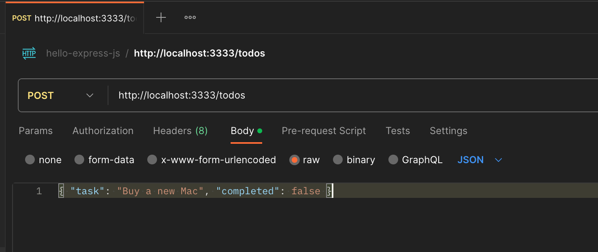
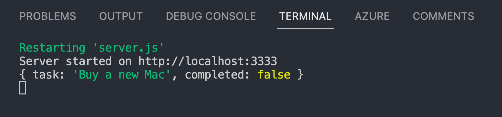
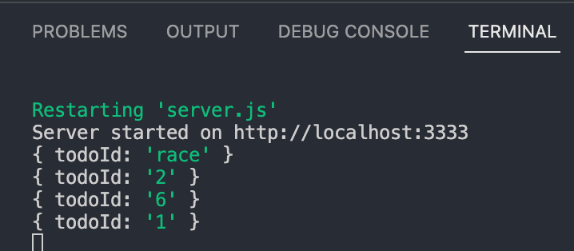
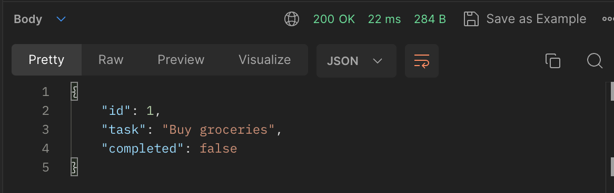
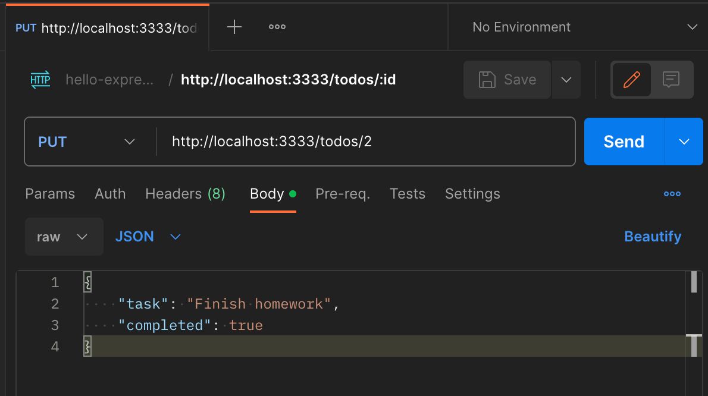
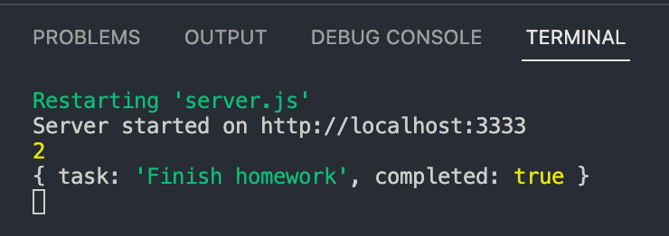

# Hello Express.js 🚀

I denne øvelse skal du oprette en HTTP-server og et simpelt API med
**Express.js**.

Du har tidligere arbejdet direkte med Node.js' `node:http`-modul. Nu
skal du se, hvordan Express.js gør mange af de samme opgaver enklere.

Du kommer til at arbejde med:

-   Express.js
-   routing og HTTP methods
-   JSON responses og requests
-   middleware
-   route parameters
-   status codes
-   CRUD-operationer
-   CORS
-   `.gitignore`

> 💡 Express.js er et framework til Node.js, som gør det lettere at
> bygge webservere og HTTP API'er.

Inden du starter, skal du have:

-   Node.js installeret
-   Postman eller Thunder Client klar til at teste HTTP requests
-   gennemført *Hello Node.js* og gerne *Hello HTTP Module*

------------------------------------------------------------------------

## 1. Opret et nyt projekt

``` bash
mkdir hello-express
cd hello-express
code .
npm init -y
```

Tilføj ES Modules i `package.json`:

``` json
"type": "module"
```

> 💡 Du har lavet denne opsætning før. Gentagelsen er med vilje.

## 2. Installer Express

``` bash
npm install express
```

Undersøg `package.json`. Express bør nu stå under `dependencies`. Du vil
også se `node_modules/` og `package-lock.json`.

-   `package.json` beskriver blandt andet projektets dependencies.
-   `package-lock.json` låser de konkrete installerede versioner.
-   `node_modules` indeholder de installerede packages.

------------------------------------------------------------------------

# Din første Express-server

## 3. Opret server.js og importer Express

Opret filen:

``` text
server.js
```

Tilføj derefter:

``` js
import express from "express";

const server = express();
```

## 4. Opret din første route

``` js
server.get("/", (request, response) => {
  response.send("Hello Express.js 🎉");
});
```

En route består her af `GET + /`: Når serveren modtager et GET request
til `/`, køres callback-funktionen.

## 5. Start serveren

``` js
const port = 3333;

server.listen(port, () => {
  console.log(`Server is running on http://localhost:${port}`);
});
```

Samlet:

``` js
import express from "express";

const server = express();
const port = 3333;

server.get("/", (request, response) => {
  response.send("Hello Express.js 🎉");
});

server.listen(port, () => {
  console.log(`Server is running on http://localhost:${port}`);
});
```

Start serveren:

``` bash
node server.js
```

Test `http://localhost:3333` i browseren og i Postman/Thunder Client.
Undersøg status code, headers, `Content-Type` og body.

Stop derefter serveren med `ctrl + c`, inden du går videre.

## 6. Brug watch og npm start

Start serveren igen med watch:

``` bash
node --watch server.js
```

Tilføj derefter:

``` json
"scripts": {
  "start": "node --watch server.js"
}
```

Nu kan du bruge:

``` bash
npm start
```

Ændr teksten i din `/`-route, gem filen, og kontrollér, at serveren
genstarter automatisk. Lad derefter `npm start` køre, mens du arbejder
videre med resten af øvelsen. Stop serveren med `ctrl + c`, når du er
helt færdig.

> 💡 Hvis du får fejlen `EADDRINUSE`, kører der sandsynligvis allerede
> en server på port `3333`. Find terminalen med serverprocessen, og stop
> den med `ctrl + c`, før du prøver igen.

------------------------------------------------------------------------

# Express vs. node:http

## 7. Sammenlign serverne

Med `node:http` kunne routing fx kræve:

``` js
if (request.method === "GET" && request.url === "/") {
  response.statusCode = 200;
  response.setHeader("Content-Type", "text/plain");
  response.end("Hello HTTP");
}
```

Med Express:

``` js
server.get("/", (request, response) => {
  response.send("Hello Express.js");
});
```

Reflektér over, hvad Express håndterer for dig: HTTP method, path,
status, headers og response.

> 💡 Express erstatter ikke HTTP. Det giver et enklere API til at
> arbejde med HTTP i Node.js.

------------------------------------------------------------------------

# Routing

## 8. HTTP methods og routes

Tilføj følgende routes i `server.js` før `server.listen()`:

``` js
server.get("/test", (request, response) => {
  response.send("GET request");
});

server.post("/test", (request, response) => {
  response.send("POST request");
});

server.put("/test", (request, response) => {
  response.send("PUT request");
});

server.patch("/test", (request, response) => {
  response.send("PATCH request");
});

server.delete("/test", (request, response) => {
  response.send("DELETE request");
});
```

Test alle fem i Postman/Thunder Client.

**Tænk over:** Hvorfor kan alle routes godt bruge `/test`, når HTTP
method er forskellig?

------------------------------------------------------------------------

# JSON Responses

## 9. Tilføj todos

Opret `data.js`:

``` js
export const todos = [
  { id: 1, task: "Buy groceries", completed: false },
  { id: 2, task: "Finish homework", completed: false },
  { id: 3, task: "Call mom", completed: false },
  { id: 4, task: "Go for a run", completed: false },
  { id: 5, task: "Read a book", completed: false },
  { id: 6, task: "Write a blog post", completed: false }
];
```

Importer øverst i `server.js`, lige under importen af Express:

``` js
import { todos } from "./data.js";
```

## 10. GET /todos

``` js
server.get("/todos", (request, response) => {
  response.json(todos);
});
```

Test `GET http://localhost:3333/todos` og undersøg `Content-Type`.

`response.json(todos)` serialiserer data til JSON, sætter relevant
Content-Type og sender responset. Sammenlign med `node:http`:

``` js
response.setHeader("Content-Type", "application/json");
response.end(JSON.stringify(todos));
```

> 💡 Todos ligger kun i programmets hukommelse. POST, PUT og DELETE
> ændrer derfor data midlertidigt. Når serveren genstartes, bliver
> dataene indlæst på ny fra `data.js`.

------------------------------------------------------------------------

# JSON Requests

## 11. Opret POST /todos

Start med:

``` js
server.post("/todos", (request, response) => {
  console.log(request.body);
  response.send("Todo received");
});
```

Det er en midlertidig version af routen. Du erstatter den med den
færdige POST-route i trin 14.

Send et POST request. Tilføj derefter JSON body:

``` json
{
  "task": "Buy a new Mac",
  "completed": false
}
```



Sørg for `Content-Type: application/json`. Hvad viser `request.body`?
Sandsynligvis stadig `undefined`.

## 12. express.json()

Tilføj efter `const server = express();` og før dine routes:

``` js
server.use(express.json());
```

Test igen. Nu parser middleware JSON-body'en og gør den tilgængelig som
`request.body`.



``` text
JSON request
     ↓
express.json()
     ↓
request.body
     ↓
route
```

## 13. Tilføj den nye todo

En todo skal have et `id`, en `task` og en `completed`-værdi. De to
sidste værdier kommer fra JSON-body'en og kan læses gennem
`request.body`.

Tilføj følgende inde i callback-funktionen for `POST /todos`:

``` js
const newTodo = {
  id: todos.length + 1,
  task: request.body.task,
  completed: request.body.completed
};

todos.push(newTodo);
```

Her oprettes først et nyt todo-objekt. Derefter tilføjer `push()` det
til `todos`-arrayet.

> 💡 Denne id-løsning er kun til øvelsen. En database vil typisk
> håndtere id på en anden måde.

## 14. Returner 201 Created

Erstat nu den midlertidige `POST /todos`-route med den samlede route:

``` js
server.post("/todos", (request, response) => {
  const newTodo = {
    id: todos.length + 1,
    task: request.body.task,
    completed: request.body.completed
  };

  todos.push(newTodo);
  response.status(201).json(newTodo);
});
```

Test status `201 Created`, response body og derefter `GET /todos`.

------------------------------------------------------------------------

# Dynamic Routes / Route Parameters

## 15. Hent én bestemt todo

Opret:

``` js
server.get("/todos/:todoId", (request, response) => {
  console.log(request.params);
  response.send("Check the terminal");
});
```

Det er en midlertidig route, som du bygger videre på i de næste trin.

Test `/todos/4`, `/todos/5`, `/todos/2`, `/todos/race` og
`/todos/hullabulla`.



## 16. request.params

I `/todos/:todoId` er `:todoId` dynamisk. Værdien findes i:

``` js
request.params.todoId
```

Route parameters er strings. `/todos/4` giver altså `"4"`.

## 17. Find den rigtige todo

Opdater routen, så den finder og returnerer den rigtige todo:

``` js
server.get("/todos/:todoId", (request, response) => {
  const todoId = Number(request.params.todoId);
  const todo = todos.find(todo => todo.id === todoId);

  response.json(todo);
});
```



## 18. Hvad hvis todo'en ikke findes?

Erstat routen fra trin 17 med denne version, som også håndterer et id,
der ikke findes:

``` js
server.get("/todos/:todoId", (request, response) => {
  const todoId = Number(request.params.todoId);
  const todo = todos.find(todo => todo.id === todoId);

  if (!todo) {
    return response.status(404).json({
      message: "Todo not found"
    });
  }

  response.json(todo);
});
```

Test både et eksisterende id og fx `/todos/999`.

------------------------------------------------------------------------

# Update

## 19. PUT /todos/:todoId

Et request kan fx være `PUT /todos/2` med:

``` json
{
  "task": "Finish homework",
  "completed": true
}
```



Data kommer nu fra to steder:

``` text
URL                request body
 ↓                      ↓
todoId              nye værdier
```

Altså `request.params` og `request.body`.

## 20. Find og opdater todo

Opret routen, og start med at logge begge dele:

``` js
server.put("/todos/:todoId", (request, response) => {
  const todoId = Number(request.params.todoId);

  console.log(todoId);
  console.log(request.body);
});
```



Erstat derefter routen med den samlede version, som finder, validerer
og opdaterer todo'en:

``` js
server.put("/todos/:todoId", (request, response) => {
  const todoId = Number(request.params.todoId);
  const todo = todos.find(todo => todo.id === todoId);

  if (!todo) {
    return response.status(404).json({
      message: "Todo not found"
    });
  }

  todo.task = request.body.task;
  todo.completed = request.body.completed;

  response.json(todo);
});
```

Her ændres kun `task` og `completed`. Todo'ens `id` forbliver det samme.

Test med PUT og kontrollér bagefter med GET.

------------------------------------------------------------------------

# Delete

## 21. DELETE /todos/:todoId

Nu er det din tur. Opret `DELETE /todos/:todoId`.

Routen skal:

1.  læse `todoId` fra `request.params`
2.  finde todo'en
3.  returnere `404`, hvis den ikke findes
4.  fjerne todo'en fra arrayet
5.  sende status `204 No Content`, når todo'en er slettet

Du kan fx bruge `findIndex()` og `splice()`.

Et response uden body kan sendes sådan:

``` js
response.status(204).end();
```

Test med `DELETE /todos/3` og kontrollér bagefter med `GET /todos`.

------------------------------------------------------------------------

# CRUD

## 22. Hvad har du bygget?

``` text
GET    /todos          → hent alle
GET    /todos/:todoId  → hent én
POST   /todos          → opret
PUT    /todos/:todoId  → opdater
DELETE /todos/:todoId  → slet
```

  CRUD     HTTP     Handling
  -------- -------- ----------
  Create   POST     Opret
  Read     GET      Hent
  Update   PUT      Opdater
  Delete   DELETE   Slet

> 💡 CRUD og HTTP methods er ikke det samme, men de kobles ofte sådan i
> HTTP API'er.

------------------------------------------------------------------------

# CORS

## 23. En kort note om CORS

Postman og Thunder Client kræver normalt ikke CORS. CORS bliver relevant
i browseren, når fx:

``` text
Frontend: http://localhost:5173
API:      http://localhost:3333
```

Installer:

``` bash
npm install cors
```

Tilpas toppen af `server.js`, så importerne står øverst, og middleware
bruges efter `const server = express();` og før dine routes:

``` js
import express from "express";
import cors from "cors";

const server = express();

server.use(cors());
server.use(express.json());
```

Slå `cors()` til og fra og undersøg response headers.

> 💡 `server.use(cors())` tillader bred cross-origin adgang. I
> produktion kan CORS begrænses til bestemte origins.

------------------------------------------------------------------------

# Git

## 24. Ignorer node_modules

Opret `.gitignore`:

``` gitignore
node_modules
```

`node_modules` skal normalt ikke pushes. Dependencies beskrives i
`package.json` og `package-lock.json` og kan installeres med:

``` bash
npm install
```

Commit altså `package.json` og `package-lock.json`, men ikke
`node_modules`.

Dit projekt ser nu cirka sådan ud:

``` text
hello-express/
├── .gitignore
├── data.js
├── node_modules/       (ignoreres af Git)
├── package-lock.json
├── package.json
└── server.js
```

------------------------------------------------------------------------

# Saml forståelsen

## 25. Hvad gør Express nemmere?

Med `node:http` arbejdede du fx direkte med:

``` js
request.method
request.url
response.statusCode
response.setHeader()
response.end()
JSON.stringify()
```

Med Express bruger du fx:

``` js
server.get()
server.post()
server.put()
server.delete()

response.send()
response.json()
response.status()

request.body
request.params
```

Express fjerner ikke HTTP. Det giver abstraktioner og værktøjer, som gør
HTTP lettere at arbejde med:

``` text
HTTP request
     ↓
middleware
     ↓
Express routing
     ↓
route handler
     ↓
data / logik
     ↓
HTTP response
```

------------------------------------------------------------------------

# 🧪 Eksperimentér

Prøv fx at:

-   tilføje en ny property til todos
-   lave `GET /status`
-   validere om `task` findes ved `POST /todos`
-   returnere `400 Bad Request`, hvis nødvendige data mangler
-   undersøge forskellige status codes i Postman
-   lave en simpel frontend, der henter `/todos`

------------------------------------------------------------------------

# ✅ Reflektér over din læring

Når du er færdig, skal du gerne kunne forklare:

1.  Hvad er Express.js?
2.  Hvordan adskiller Express sig fra `node:http`?
3.  Hvad er en route?
4.  Hvordan hænger HTTP method og path sammen?
5.  Hvad gør `response.send()`?
6.  Hvad gør `response.json()`?
7.  Hvad gør `express.json()`?
8.  Hvad er middleware?
9.  Hvad er `request.body`?
10. Hvad er en route parameter?
11. Hvad er `request.params`?
12. Hvorfor skal et route parameter-id ofte konverteres til et number?
13. Hvad betyder `200 OK`?
14. Hvornår bruger vi `201 Created`?
15. Hvornår bruger vi `404 Not Found`?
16. Hvordan hænger GET, POST, PUT og DELETE sammen med CRUD?
17. Hvornår bliver CORS relevant?
18. Hvorfor skal `node_modules` være i `.gitignore`?

## Det vigtigste

Du behøver ikke kunne huske alle Express-metoder udenad.

Det vigtigste er, at du forstår flowet:

``` text
HTTP request
      ↓
Express
      ↓
middleware
      ↓
route
      ↓
request data
      ↓
logik
      ↓
response
```

og at du kan se, hvordan Express gør de HTTP-koncepter, du allerede har
arbejdet med, lettere at implementere.
