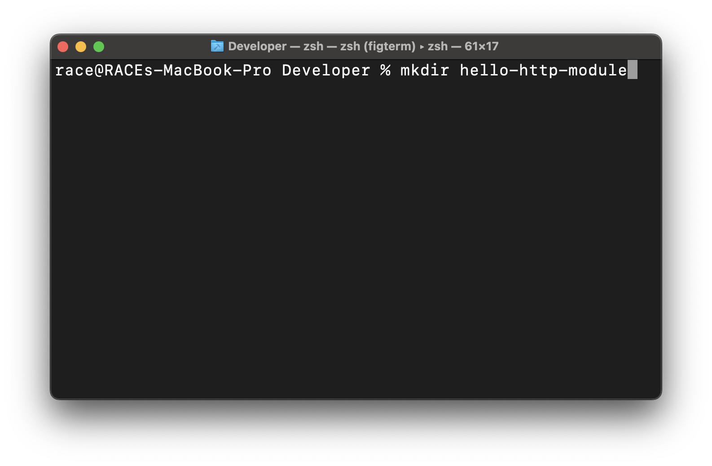
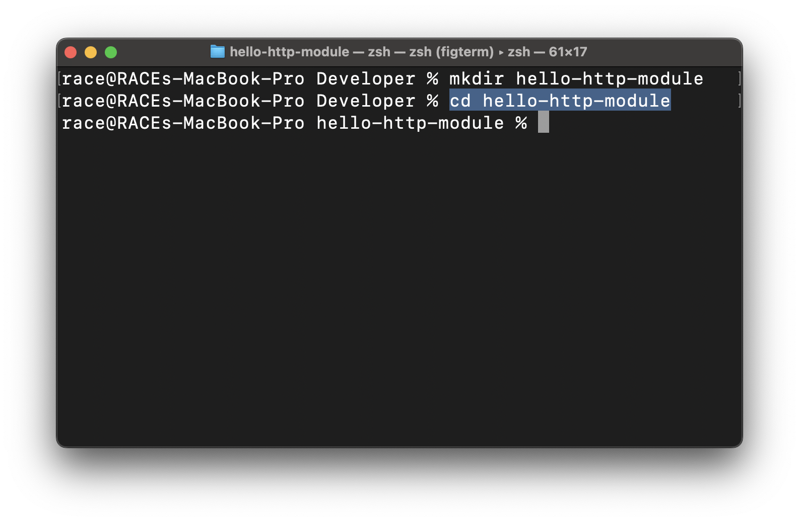
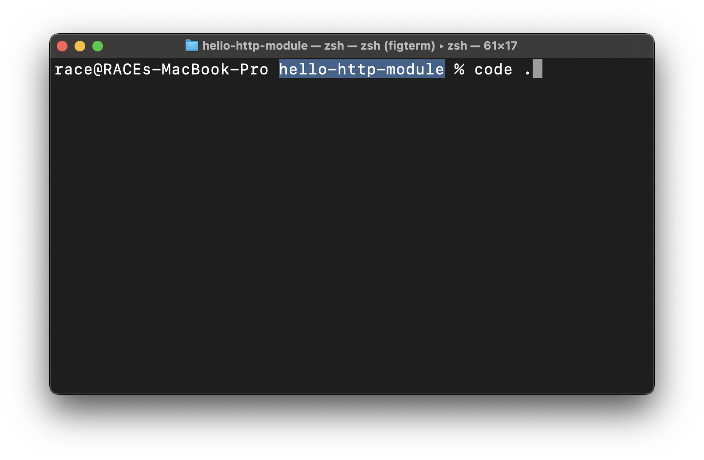
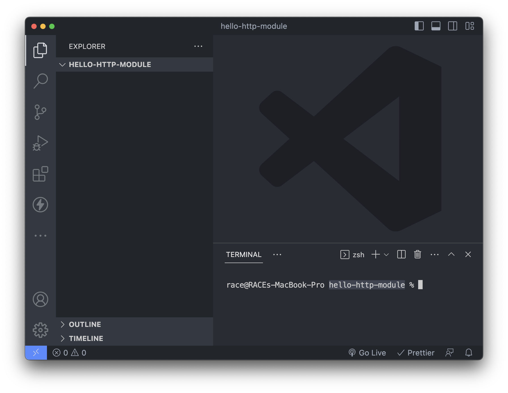
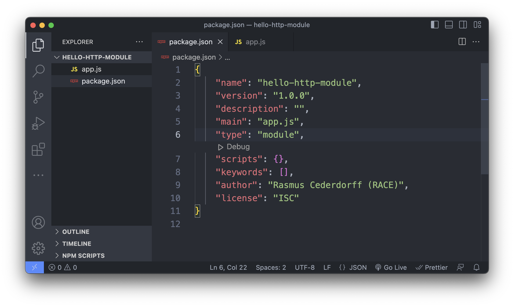
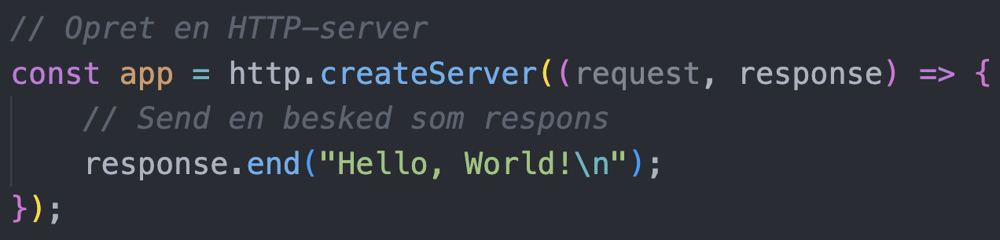
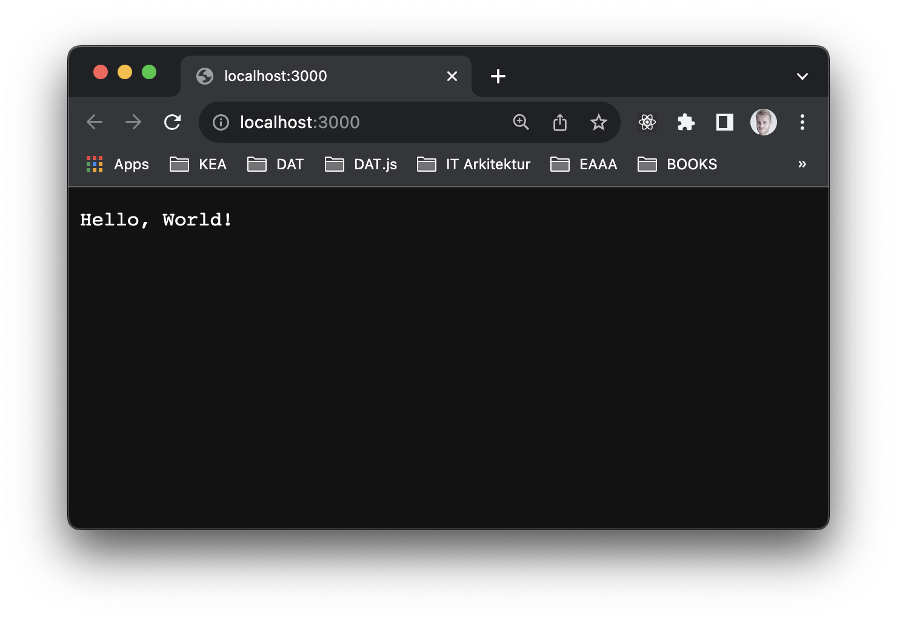

# Hello HTTP Module

I denne øvelse skal du oprette en HTTP-server med **Node.js -- uden
Express.js**.

Du bygger videre på det, du lærte i _Hello Node.js_, men starter et nyt
projekt, så du får gentaget opsætningen af en Node.js-applikation.

Du kommer til at arbejde med:

- Node.js og `node:http`
- HTTP server
- request og response
- status codes og headers
- JSON
- ES Modules
- simpel routing
- `GET` requests
- `404 Not Found`

> 💡 Målet er at forstå, hvad der grundlæggende sker, når en klient
> sender et HTTP request til en server, og serveren sender et HTTP
> response tilbage.

---

## 1. Opret et nyt projekt

Opret en ny mappe:

```bash
mkdir hello-http-module
```



Naviger ind i mappen:

```bash
cd hello-http-module
```



Åbn mappen i VS Code:

```bash
code .
```



Når VS Code åbner, kan projektet se sådan ud:



Du kan selvfølgelig også oprette og åbne projektmappen, som du plejer
via GitHub Desktop og VS Code.

---

## 2. Initialiser projektet

Sørg for, at du står i projektmappen.

Kør:

```bash
npm init -y
```

Der bliver nu oprettet en `package.json`.

Tilføj:

```json
"type": "module"
```



Det gør det muligt at bruge ES Modules med `import` og `export`.

Din `package.json` vil cirka se sådan ud:

```json
{
  "name": "hello-http-module",
  "version": "1.0.0",
  "type": "module"
}
```

> 💡 Du har gjort dette før. Gentagelsen er med vilje -- opsætningen af
> et nyt Node.js-projekt skal gerne begynde at føles genkendelig.

---

## 3. Opret app.js

Opret filen:

```text
app.js
```

Tilføj:

```js
console.log("Hello, Node.js 🎉");
```

Kør filen:

```bash
node app.js
```

Du bør se:

```text
Hello, Node.js 🎉
```


_Skærmbilledet er fra et projekt i mappen `hello-node`. I denne øvelse
står du i `hello-http-module`, men kommandoen virker på samme måde._

Indtil videre er det almindelig JavaScript, der bliver kørt med Node.js.

Nu skal vi bruge Node.js til noget nyt: **at oprette en HTTP-server**.

---

# HTTP Server

## 4. Importer HTTP-modulet

Node.js har en række indbyggede moduler, som giver os funktionalitet,
der ikke findes i almindelig JavaScript.

Et af dem er HTTP-modulet.

Slet indholdet af `app.js` og importer modulet:

```js
import http from "node:http";
```

> 💡 `node:http` er en del af Node.js. Du skal derfor ikke installere en
> package med npm.

Vi skal bruge modulet til at oprette en HTTP-server.

---

## 5. Opret en HTTP-server

Brug `http.createServer()`:

```js
import http from "node:http";

const app = http.createServer((request, response) => {
  response.end("Hello, HTTP Module 🎉");
});
```



_På skærmbilledet er response-teksten `Hello, World!`. Du skal fortsat
bruge `Hello, HTTP Module 🎉` i øvelsen._

`createServer()` modtager en callback-funktion.

Callback-funktionen bliver kørt, **hver gang serveren modtager et
request**.

Den giver os to vigtige objekter:

```js
request;
response;
```

- `request` indeholder information om det request, klienten har sendt.
- `response` bruger vi til at bygge og sende serverens svar.

Med:

```js
response.end("Hello, HTTP Module 🎉");
```

afslutter vi responset og sender teksten tilbage til klienten.

Men serveren lytter ikke efter requests endnu.

---

## 6. Lad serveren lytte

Opret en variabel med portnummeret:

```js
const port = 3000;
```

Tilføj derefter:

```js
app.listen(port, () => {
  console.log(`Server is running on http://localhost:${port}`);
});
```

Din `app.js` ser nu sådan ud:

```js
import http from "node:http";

const port = 3000;

const app = http.createServer((request, response) => {
  response.end("Hello, HTTP Module 🎉");
});

app.listen(port, () => {
  console.log(`Server is running on http://localhost:${port}`);
});
```

Start serveren:

```bash
node app.js
```

Åbn derefter:

```text
http://localhost:3000
```

i browseren.

Du bør se:

```text
Hello, HTTP Module 🎉
```



_Browseren viser den alternative response-tekst `Hello, World!` fra
skærmbilledet ovenfor. Din browser viser den tekst, du har skrevet i
`response.end()`._

🎉 Du har nu oprettet din første HTTP-server med Node.js.

### Hvad sker der?

Når du åbner `http://localhost:3000`, sker der grundlæggende dette:

```text
Browser / klient
      ↓
   HTTP request
      ↓
 Node.js server
      ↓
  HTTP response
      ↓
Browser / klient
```

Browseren er klienten, der sender et request.

Din Node.js-applikation er serveren, der modtager requestet og sender et
response tilbage.

---

## 7. Undersøg requestet

Lad os se nærmere på det request, serveren modtager.

Tilføj følgende inde i callback-funktionen:

```js
console.log(request.method);
console.log(request.url);
```

Din server ser nu sådan ud:

```js
const app = http.createServer((request, response) => {
  console.log(request.method);
  console.log(request.url);

  response.end("Hello, HTTP Module 🎉");
});
```

Genstart serveren.

Åbn:

```text
http://localhost:3000
```

Hvad bliver udskrevet i terminalen?

Du bør blandt andet kunne se:

```text
GET
/
```

### `request.method`

Fortæller hvilken **HTTP method** klienten bruger.

Browseren sender her et:

```text
GET
```

Et `GET` request bruges til at hente en ressource.

### `request.url`

Fortæller hvilken sti klienten requester.

Når du åbner:

```text
http://localhost:3000/
```

er URL'en:

```text
/
```

Prøv fx at åbne:

```text
http://localhost:3000/hello
```

Hvad viser `request.url` nu?

> 💡 Gem `request.method` og `request.url` i baghovedet. Vi skal bruge
> dem senere til routing.

---

## 8. Brug watch

Prøv at ændre teksten i:

```js
response.end("Hello, HTTP Module 🎉");
```

Serveren skal genstartes, før ændringen træder i kraft.

Du kan derfor køre serveren med:

```bash
node --watch app.js
```

Nu holder Node.js øje med ændringer og genstarter automatisk serveren.

Stop serveren igen med:

```text
ctrl + c
```

### Opret et npm script

Tilføj et start-script i `package.json`:

```json
"scripts": {
  "start": "node --watch app.js"
}
```

Nu kan serveren startes med:

```bash
npm start
```

> 💡 Det er samme princip som i _Hello Node.js_. Denne gang holder
> Node.js bare en rigtig HTTP-server kørende.

---

# HTTP Response

## 9. Status code, headers og body

Et HTTP response består blandt andet af:

- **status code**
- **headers**
- **body**

Indtil videre har vi kun fokuseret på body:

```js
response.end("Hello, HTTP Module 🎉");
```

Lad os gøre responset mere tydeligt.

Tilføj:

```js
response.statusCode = 200;
response.setHeader("Content-Type", "text/plain");
response.end("Hello, HTTP Module 🎉");
```

Din callback ser nu sådan ud:

```js
const app = http.createServer((request, response) => {
  response.statusCode = 200;
  response.setHeader("Content-Type", "text/plain");

  response.end("Hello, HTTP Module 🎉");
});
```

### Status code

```js
response.statusCode = 200;
```

Statuskoden fortæller klienten, hvordan requestet gik.

`200` betyder:

```text
200 OK
```

Requestet blev håndteret korrekt.

### Content-Type

```js
response.setHeader("Content-Type", "text/plain");
```

Headeren fortæller klienten, hvilken type indhold der bliver sendt
tilbage.

Her sender vi almindelig tekst.

### Body

```js
response.end("Hello, HTTP Module 🎉");
```

Dette er selve indholdet i responset.

### Undersøg responset

Test serveren i browseren og gerne i Postman.

Undersøg:

- status code
- `Content-Type`
- response body

Kan du finde alle tre dele?

---

# Fra JavaScript til JSON

## 10. Opret en liste med users

Tilføj et array med users øverst i `app.js`:

```js
const users = [
  {
    id: 1,
    name: "Rasmus Cederdorff",
    mail: "race@eaaa.dk",
    title: "Senior Lecturer"
  },
  {
    id: 2,
    name: "Peter Lind",
    mail: "petl@example.com",
    title: "Senior Lecturer"
  },
  {
    id: 3,
    name: "Edith Terte",
    mail: "edith@example.com",
    title: "Lecturer"
  }
];
```

Test først dataen:

```js
console.log(users);
```

Du bør kunne se arrayet i terminalen.

### Send users som response

Prøv nu at erstatte teksten i `response.end()` med:

```js
response.end(users);
```

Hvad sker der?

Læs fejlbeskeden i terminalen.

Prøv at finde ud af, hvad Node.js fortæller dig.

---

## 11. Konverter til JSON

`users` er et JavaScript-array.

Vi kan ikke sende arrayet direkte med `response.end()`.

Vi skal først **serialisere** vores JavaScript-data til et format, der
kan sendes som HTTP-response.

Her bruger vi JSON.

Konverter `users` med:

```js
JSON.stringify(users);
```

og send resultatet:

```js
response.end(JSON.stringify(users));
```

Test igen.

Nu bør du kunne se dine users i browseren.

### Hvad skete der?

```text
JavaScript array
      ↓
 JSON.stringify()
      ↓
   JSON text
      ↓
 HTTP response
      ↓
    klient
```

`JSON.stringify()` konverterer JavaScript-data til JSON-tekst.

---

## 12. Fortæl klienten, at det er JSON

Serveren sender nu JSON, men vores header siger stadig:

```text
text/plain
```

Det er ikke korrekt.

Ændr derfor:

```js
response.setHeader("Content-Type", "text/plain");
```

til:

```js
response.setHeader("Content-Type", "application/json");
```

Dit response ser nu sådan ud:

```js
response.statusCode = 200;
response.setHeader("Content-Type", "application/json");
response.end(JSON.stringify(users));
```

Test igen i browseren og Postman.

Undersøg især headeren:

```text
Content-Type: application/json
```

> 💡 `Content-Type` fortæller klienten, hvordan den skal fortolke
> indholdet i response body.

---

# ES Modules

## 13. Flyt users til et modul

Lige nu ligger både serverlogik og data i `app.js`.

Lad os dele koden op.

Opret fx:

```text
data/users.js
```

Flyt `users` til filen og eksporter arrayet:

```js
export const users = [
  {
    id: 1,
    name: "Rasmus Cederdorff",
    mail: "race@eaaa.dk",
    title: "Senior Lecturer"
  },
  {
    id: 2,
    name: "Peter Lind",
    mail: "petl@example.com",
    title: "Senior Lecturer"
  },
  {
    id: 3,
    name: "Edith Terte",
    mail: "edith@example.com",
    title: "Lecturer"
  }
];
```

Importer derefter `users` i `app.js`:

```js
import { users } from "./data/users.js";
```

Kontroller, at serveren stadig fungerer.

### Tænk tilbage

Tidligere tilføjede du:

```json
"type": "module"
```

til `package.json`.

Hvorfor var det vigtigt?

> 💡 Du kan stadig møde `require()` og `module.exports` i ældre
> Node.js-kode og tutorials. I denne øvelse bruger vi ES Modules med
> `import` og `export`, som du allerede kender fra client-side
> JavaScript.

---

## 14. Tilføj posts

Opret:

```text
data/posts.js
```

Tilføj fx:

```js
export const posts = [
  {
    id: 1,
    caption: "Beautiful sunset at the beach",
    uid: 1
  },
  {
    id: 2,
    caption: "Exploring the city streets of Aarhus",
    uid: 3
  },
  {
    id: 3,
    caption: "A cozy morning with coffee",
    uid: 2
  }
];
```

Importer `posts` i `app.js`:

```js
import { posts } from "./data/posts.js";
```

Test importen:

```js
console.log(posts);
```

Du skal ikke sende `posts` til klienten endnu.

Det kommer vi til nu.

---

# Routing

## 15. Hvad er en route?

Indtil videre sender serveren det samme response, uanset hvilken URL
klienten requester.

Men en server skal typisk kunne håndtere forskellige requests.

Vi vil fx have:

```text
GET /
GET /users
GET /posts
```

En **route** kobler et bestemt HTTP request til den kode, der skal
håndtere requestet.

Vi kan bruge de to værdier, vi undersøgte tidligere:

```js
request.method;
request.url;
```

---

## 16. Din første route

Start med at håndtere:

```text
GET /
```

I callback-funktionen kan du teste requestet:

```js
if (request.method === "GET" && request.url === "/") {
  response.statusCode = 200;
  response.setHeader("Content-Type", "text/plain");
  response.end("Working with HTTP Module and routing 🎉");
}
```

Test:

```text
http://localhost:3000/
```

---

## 17. Tilføj /users

Tilføj en ny route:

```js
else if (request.method === "GET" && request.url === "/users") {
  response.statusCode = 200;
  response.setHeader("Content-Type", "application/json");
  response.end(JSON.stringify(users));
}
```

Test:

```text
http://localhost:3000/users
```

Du bør nu få alle users som JSON.

### Læg mærke til forskellen

På `/` sender vi:

```text
Content-Type: text/plain
```

På `/users` sender vi:

```text
Content-Type: application/json
```

Hvorfor?

---

## 18. Lav selv /posts

Nu er det din tur.

Opret en route for:

```text
GET /posts
```

Den skal:

1.  kontrollere `request.method`
2.  kontrollere `request.url`
3.  bruge status code `200`
4.  bruge `Content-Type: application/json`
5.  sende `posts` som JSON

Test derefter:

```text
http://localhost:3000/posts
```

Når det virker, skal din server kunne håndtere:

```text
GET /        → tekst
GET /users   → users som JSON
GET /posts   → posts som JSON
```

---

## 19. Hvad hvis routen ikke findes?

Prøv at åbne:

```text
http://localhost:3000/bananas
```

Hvad sker der?

Vi har ikke lavet en route, der håndterer dette request.

Serveren bør derfor fortælle klienten, at ressourcen ikke findes.

Efter dine routes kan du tilføje:

```js
else {
  response.statusCode = 404;
  response.setHeader("Content-Type", "text/plain");
  response.end("Not Found");
}
```

Test igen:

```text
http://localhost:3000/bananas
```

Undersøg også responset i Postman.

Du bør nu få:

```text
404 Not Found
```

> 💡 `404` betyder, at serveren ikke kunne finde den ressource, klienten
> bad om.

---

# Saml forståelsen

## 20. Request → route → response

Din server kan nu modtage forskellige HTTP requests og sende forskellige
responses tilbage.

Den grundlæggende proces ser sådan ud:

```text
Client
  ↓
HTTP request
  ↓
method + url
  ↓
Node.js HTTP server
  ↓
route
  ↓
data / logik
  ↓
HTTP response
  ↓
status + headers + body
  ↓
Client
```

Du har altså bygget en server, der kan håndtere:

```text
GET /
GET /users
GET /posts
```

og returnere:

```text
404 Not Found
```

når en route ikke findes.

---

# Eksperimentér

Prøv selv at bygge videre.

Du kan fx:

- tilføje en `/hello` route
- tilføje en `/about` route
- returnere et JavaScript-objekt som JSON
- tilføje flere users
- tilføje flere posts
- prøve andre URL'er og undersøge `request.url`
- teste alle routes i Postman

Du kan også prøve at lave en route:

```text
GET /status
```

som returnerer:

```json
{
  "status": "ok"
}
```

---

# Reflektér over læring

Når du er færdig, skal du gerne kunne forklare:

1.  Hvad er Node.js' `http`-modul?
2.  Hvad gør `http.createServer()`?
3.  Hvad er forskellen på `request` og `response`?
4.  Hvad fortæller `request.method`?
5.  Hvad fortæller `request.url`?
6.  Hvad betyder HTTP status code `200`?
7.  Hvad betyder HTTP status code `404`?
8.  Hvad er en HTTP header?
9.  Hvad fortæller `Content-Type`?
10. Hvorfor bruger vi `JSON.stringify()`?
11. Hvorfor bruger vi `application/json`, når vi sender JSON?
12. Hvad er en route?
13. Hvorfor er routing nødvendigt, når en frontend skal kommunikere med
    en backend?
14. Hvordan hænger `import` og `export` sammen med `"type": "module"`?

## Det vigtigste

Du behøver ikke kunne huske al syntaksen udenad.

Det vigtigste er, at du forstår den grundlæggende sammenhæng:

```text
request
   ↓
server
   ↓
routing
   ↓
response
```

og at et HTTP response blandt andet består af:

```text
status code
headers
body
```

Det er fundamentet for det videre arbejde med server-side JavaScript og
HTTP API'er.
