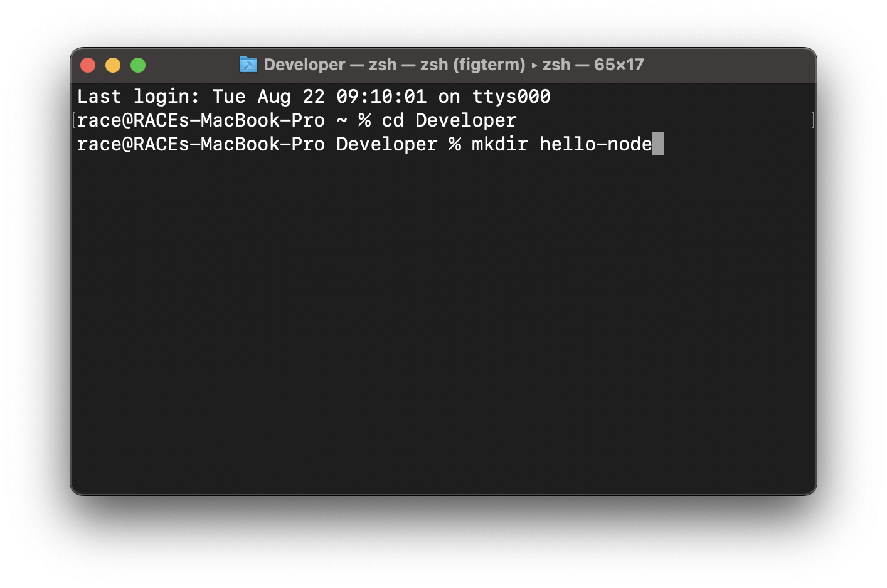
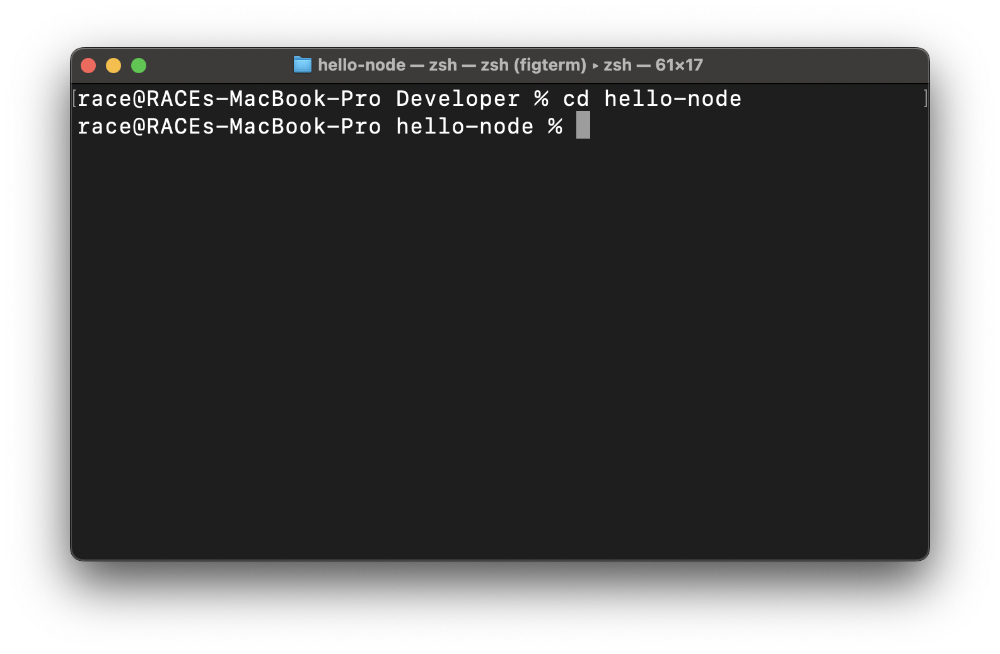
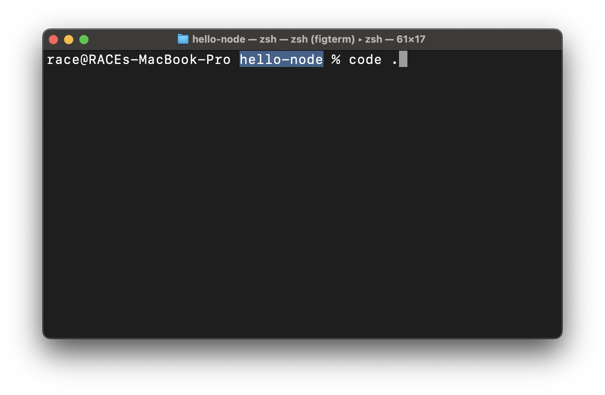
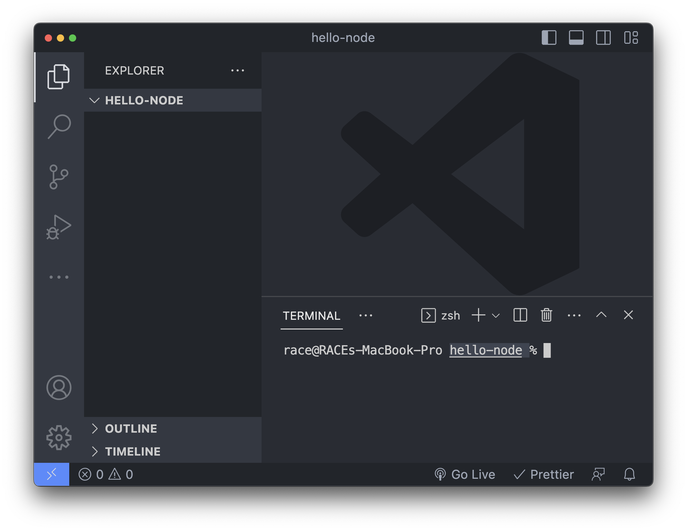
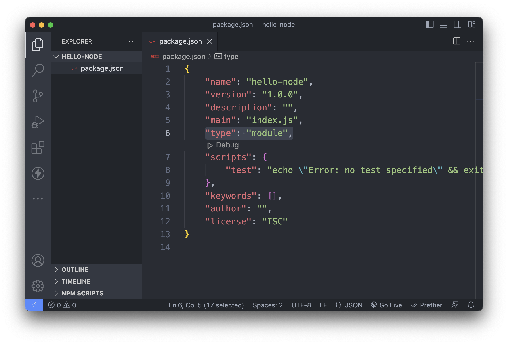
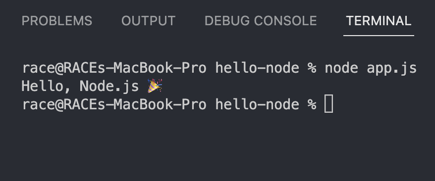
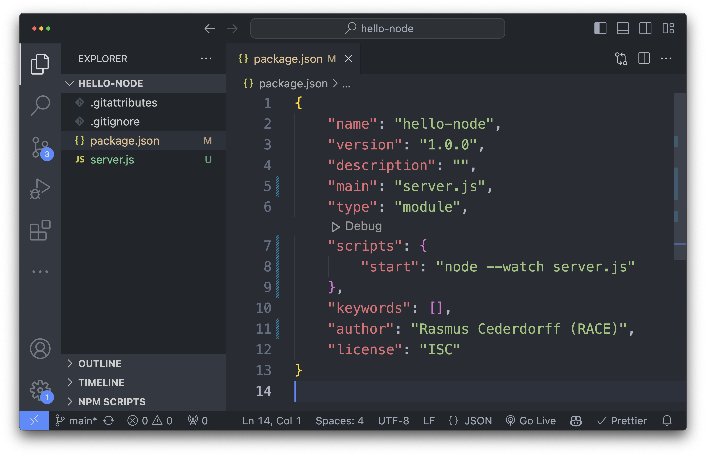

# Hello Node.js 👋

I denne øvelse skal du oprette dit første Node.js-projekt og køre
JavaScript med Node.js.

Du kommer til at arbejde med:

- Node.js og terminalen
- `npm`
- `package.json`
- `node`
- `node --watch`
- npm scripts
- JavaScript uden for browseren

> 💡 **Node.js gør det muligt at køre JavaScript uden for browseren.**
>
> I stedet for at browseren kører din JavaScript-kode, skal vi nu bruge
> Node.js.

---

## 1. Opret et nyt projekt

Opret en ny mappe til projektet:

```bash
mkdir hello-node
```



_Her oprettes projektmappen `hello-node` i mappen `Developer`._

Naviger ind i mappen:

```bash
cd hello-node
```



Hvis du bruger VS Code, kan du åbne den aktuelle mappe med:

```bash
code .
```



Når VS Code åbner, kan projektet se sådan ud:



Du kan selvfølgelig også oprette og åbne projektmappen, som du plejer
via GitHub Desktop og VS Code.

> 💡 Når du arbejder i terminalen, er det vigtigt at vide, **hvilken
> mappe du står i**. Kommandoer som `npm` og `node` køres i den aktuelle
> mappe.

---

## 2. Initialiser et Node.js-projekt

Sørg for, at du står i projektmappen `hello-node`.

Kør:

```bash
npm init -y
```

Der bliver nu oprettet en fil:

```text
package.json
```

Åbn filen og se, hvad den indeholder.

`package.json` indeholder information og konfiguration for dit
Node.js-projekt.

Den kan blandt andet indeholde:

- projektets navn og version
- npm scripts
- dependencies (pakker projektet bruger)

Vi kommer til at arbejde meget mere med `package.json` senere.

### ES Modules

Tilføj følgende til `package.json`:

```json
"type": "module"
```



Det gør det muligt at bruge moderne JavaScript-moduler med `import` og
`export`.

Din `package.json` vil cirka se sådan ud:

```json
{
  "name": "hello-node",
  "version": "1.0.0",
  "type": "module"
}
```

> 💡 Der kan godt være andre properties i din `package.json`. Det er
> helt fint.

---

## 3. Opret din første Node.js-fil

Opret filen:

```text
server.js
```

Tilføj:

```js
console.log("Hello, Node.js 🎉");
```

Du kender allerede `console.log()` fra JavaScript i browseren.

Denne gang skal vi dog ikke åbne en browser.

Vi skal i stedet bede **Node.js** om at køre filen.

---

## 4. Kør JavaScript med Node.js

Åbn terminalen og sørg for, at du står i projektmappen.

Kør:

```bash
node server.js
```

Du bør nu se:

```text
Hello, Node.js 🎉
```



_På billedet hedder JavaScript-filen `app.js`. I denne øvelse hedder den
`server.js`, men kommandoen virker på samme måde._

🎉 Du har nu kørt JavaScript med Node.js!

### Hvad skete der?

Når du skriver:

```bash
node server.js
```

beder du Node.js om at køre JavaScript-koden i `server.js`.

Node.js:

1.  læser filen
2.  kører JavaScript-koden
3.  udskriver resultatet
4.  afslutter

Browseren er altså ikke involveret.

---

## 5. Lav en ændring

Tilføj endnu en `console.log()`:

```js
console.log("Hello, Node.js 🎉");
console.log("JavaScript is running 🚀");
```

Gem `server.js`.

### Hvad sker der?

Kig i terminalen.

Der sker... ingenting 🤔

Node.js kørte nemlig filen og afsluttede bagefter.

Hvis du vil se resultatet af dine ændringer, skal du køre filen igen:

```bash
node server.js
```

Prøv nu:

1.  ændr teksten i en `console.log()`
2.  gem filen
3.  kør `node server.js` igen
4.  se resultatet

Lav gerne et par ændringer.

### Tænk over

Det fungerer fint.

Men forestil dig, at du arbejder på en større applikation og ændrer kode
hele tiden.

Så skal du hele tiden skrive:

```bash
node server.js
```

Der må være en smartere måde... 👀

---

## 6. Lad Node.js holde øje med ændringer

Node.js kan automatisk holde øje med ændringer i vores filer.

Kør:

```bash
node --watch server.js
```

Prøv nu at ændre en `console.log()` og gem `server.js`.

Hvad sker der?

Node.js opdager ændringen og kører automatisk filen igen.

### `--watch`

Flaget:

```text
--watch
```

fortæller Node.js, at den skal holde øje med ændringer og automatisk
genstarte programmet.

Du behøver derfor ikke længere skrive:

```bash
node server.js
```

efter hver ændring.

### Stop processen

Denne gang afslutter Node.js ikke efter kørslen.

Den bliver ved med at **holde øje med ændringer**.

Du kan stoppe processen i terminalen med:

```text
ctrl + c
```

> 💡 Cursoren skal være aktiv i terminalen, når du trykker `ctrl + c`.

Prøv:

1.  start med `node --watch server.js`
2.  ændr `server.js`
3.  gem filen
4.  se Node.js genstarte
5.  stop processen med `ctrl + c`

---

## 7. Opret et npm script

Vi har nu løst problemet med at skulle starte Node.js igen efter hver
ændring.

Men vi skal stadig huske og skrive:

```bash
node --watch server.js
```

hver gang vi starter projektet.

Det kan vi også gøre nemmere.

### npm scripts

I `package.json` kan vi definere kommandoer til vores projekt.

Tilføj:

```json
"scripts": {
  "start": "node --watch server.js"
}
```

Din `package.json` vil nu cirka se sådan ud:

```json
{
  "name": "hello-node",
  "version": "1.0.0",
  "type": "module",
  "scripts": {
    "start": "node --watch server.js"
  }
}
```



Nu kan du starte projektet med:

```bash
npm start
```

npm finder dit `start` script i `package.json` og kører:

```bash
node --watch server.js
```

### Prøv det

Kør:

```bash
npm start
```

Ændr derefter noget i `server.js` og gem filen.

Node.js bør automatisk køre filen igen.

Stop til sidst processen med:

```text
ctrl + c
```

> 💡 Et **npm script** er altså en navngivet kommando, som vi definerer
> i `package.json`.

---

## 8. Hvad har du egentlig gjort?

Dit projekt ser nu cirka sådan ud:

```text
hello-node/
├── package.json
└── server.js
```

Du har lært tre forskellige måder at arbejde med dit Node.js-program på.

### Kør filen én gang

```bash
node server.js
```

Node.js kører filen og afslutter.

### Hold øje med ændringer

```bash
node --watch server.js
```

Node.js kører filen og genstarter automatisk, når du gemmer ændringer.

### Brug projektets npm script

```bash
npm start
```

npm kører den kommando, der er defineret som `start` i `package.json`:

```bash
node --watch server.js
```

### Tjek din forståelse

Kan du forklare:

1.  Hvad bruger du Node.js til?
2.  Hvad gør `npm init -y`?
3.  Hvad er `package.json`?
4.  Hvordan kører du en JavaScript-fil med Node.js?
5.  Hvad er forskellen på `node server.js` og `node --watch server.js`?
6.  Hvad sker der, når du kører `npm start`?
7.  Hvad er et npm script?
8.  Hvordan stopper du en proces, der kører i terminalen?

---

# JavaScript i Node.js

Node.js er stadig **JavaScript**.

Det betyder, at meget af den JavaScript, du allerede kender fra
frontend, fungerer på samme måde.

Du kan fx arbejde med:

- variabler
- objekter
- arrays
- funktioner
- conditions
- loops
- array methods
- async/await

Den store forskel er, **hvor JavaScript-koden bliver kørt**.

I frontend-JavaScript kører din kode typisk i browseren.

Her kører JavaScript med Node.js.

Det betyder også, at browser-specifikke API'er som fx:

```js
document.querySelector();
```

ikke findes i Node.js.

Der er nemlig ingen DOM.

---

## 9. Arbejd med JavaScript

Lad os prøve noget af den JavaScript, du allerede kender.

Opret en variabel `person`, som indeholder et objekt med følgende
properties:

- `name`
- `mail`
- `age`
- `image`
- `city`

Du bestemmer selv værdierne.

Fx:

```js
const person = {
  name: "Peter",
  mail: "peter@example.com",
  age: 28,
  image: "peter.jpg",
  city: "Aarhus"
};
```

Udskriv objektet:

```js
console.log(person);
```

Gem filen og se resultatet i terminalen.

Hvis du stadig har `npm start` kørende, bør Node.js automatisk køre
filen igen.

### Prøv selv

Ændr nogle af værdierne i objektet.

Prøv derefter at udskrive enkelte properties:

```js
console.log(person.name);
console.log(person.city);
```

---

## 10. Lav en funktion

Lav en funktion med navnet `printPerson`.

Funktionen skal modtage et person-objekt og udskrive det:

```js
function printPerson(person) {
  console.log(person);
}
```

Kald funktionen:

```js
printPerson(person);
```

### Genbrug funktionen

Opret endnu et person-objekt:

```js
const person2 = {
  name: "Anna",
  mail: "anna@example.com",
  age: 32,
  image: "anna.jpg",
  city: "Odense"
};
```

Brug den samme funktion til begge objekter:

```js
printPerson(person);
printPerson(person2);
```

> 💡 Det her er ikke noget særligt Node.js-JavaScript.
>
> Det er den JavaScript, du allerede kender -- den bliver bare kørt et
> andet sted.

---

## 🧪 Eksperimentér

Prøv selv at bygge videre på programmet.

Du kan fx:

- tilføje flere properties til `person`
- oprette flere personer
- ændre `printPerson()`
- udskrive en tekst med personens navn og by
- lave et array med personer
- bruge `forEach()` eller `map()` på arrayet

Eksempel:

```js
const persons = [person, person2];

persons.forEach((person) => {
  printPerson(person);
});
```

Prøv dig frem og hold øje med terminalen.

---

# Når du er færdig

Du skal gerne kunne forklare sammenhængen:

```text
server.js
    ↓
Node.js
    ↓
JavaScript bliver kørt
    ↓
Output i terminalen
```

Og forskellen mellem:

```bash
node server.js
```

```bash
node --watch server.js
```

```bash
npm start
```

Du skal også have en grundlæggende forståelse af:

- hvad Node.js bruges til
- hvordan JavaScript køres med Node.js
- hvad `package.json` bruges til
- hvad et npm script er
- hvorfor vi bruger `--watch`
- hvordan du stopper en kørende proces
- at almindelig JavaScript også kan bruges med Node.js
- at Node.js ikke har adgang til browserens DOM
